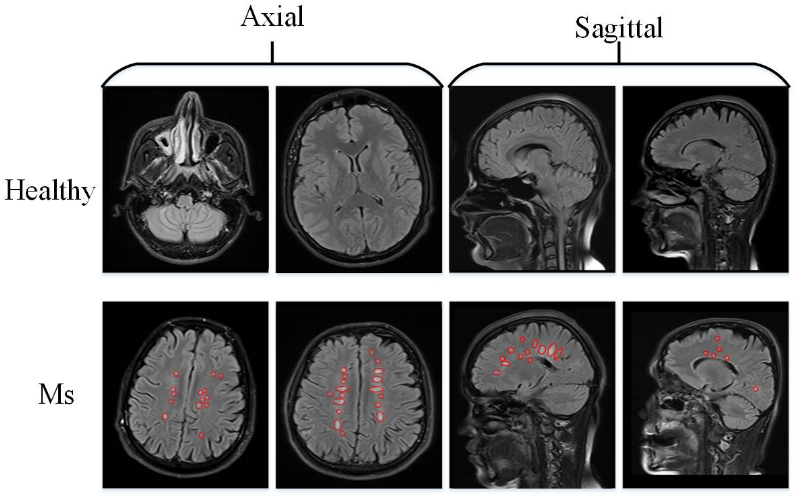
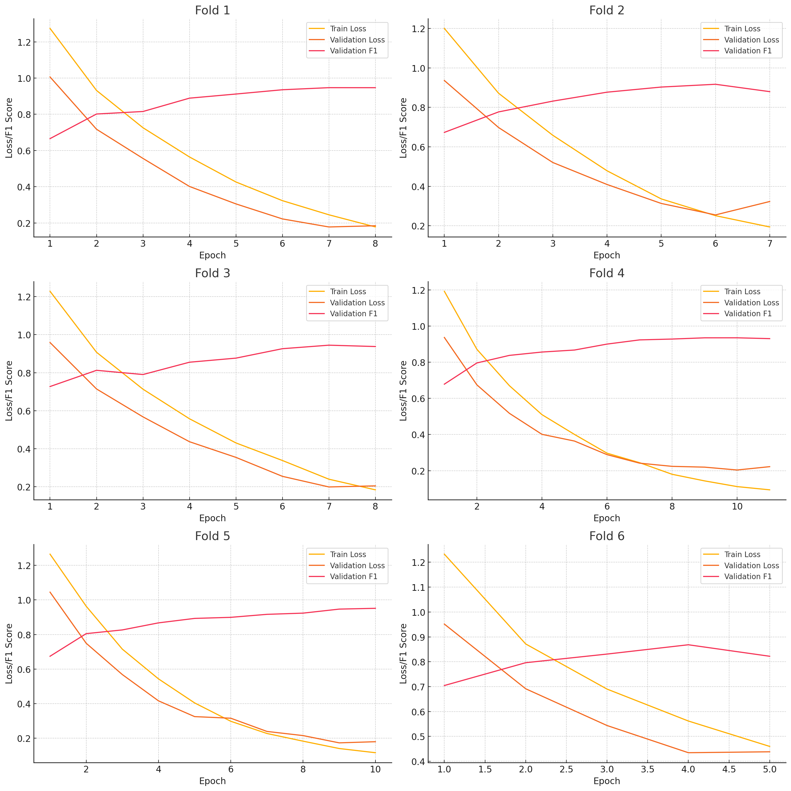
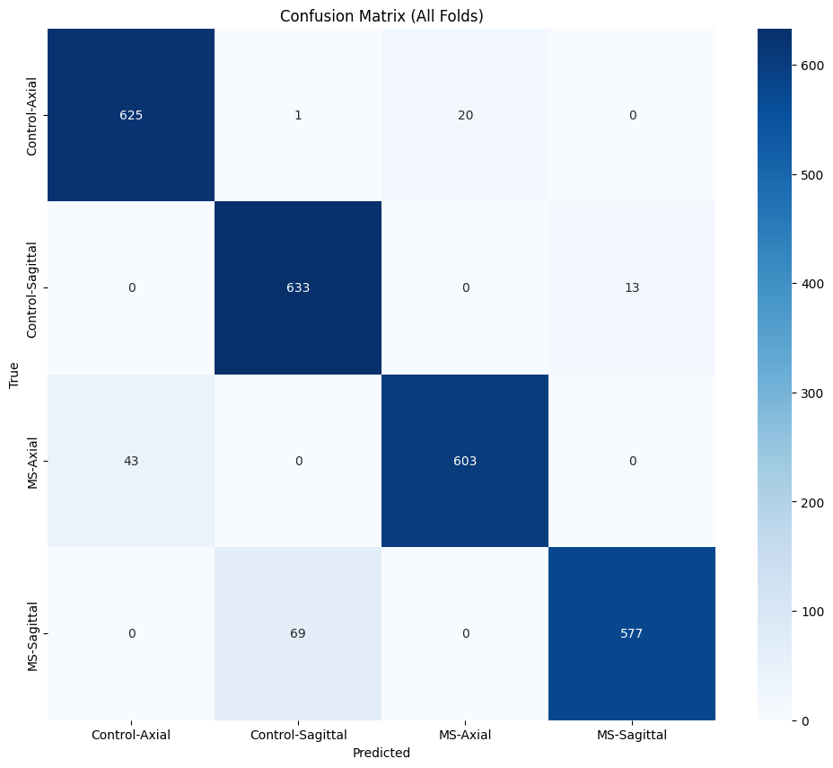

# Multiple Sclerosis MRI Classification

## Project Overview
This repository contains the implementation of a Vision Transformer (ViT) model designed to predict Multiple Sclerosis (MS) from Magnetic Resonance Imaging (MRI) scans. The goal is to classify images into one of four categories: Control-Axial, Control-Sagittal, MS-Axial, and MS-Sagittal. 

By implementing the Vision Transformer (ViT) model for MRI scans and Multiple Sclerosis detection, we showcase the model's effectiveness in medical imaging applications.

## What is Multiple Sclerosis?
Multiple Sclerosis (MS) is a chronic demyelinating disease characterized by the presence of plaques in the white matter of the central nervous system. These plaques can disrupt the flow of information within the brain, and between the brain and the rest of the body. MS can be diagnosed using MRI, which helps identify the characteristic lesions associated with the disease. Usual onset	is around age 20–50. 

It can cause a wide range of symptoms including fatigue, vision problems, mobility issues, cognitive changes, numbness, pain, speech difficulties, mood changes, heat sensitivity, and muscle spasticity, which vary in severity and occurrence among individuals.

## Dataset
The dataset and initial modeling attempts are derived from the work by Macin et al. (2022). They proposed a computationally efficient model using Exemplar Multiple Parameters Local Phase Quantization (ExMPLPQ) combined with a k-nearest neighbor (kNN) classifier. Their model achieved high accuracy in detecting MS from MRI images.

**Original Article:** [An Accurate Multiple Sclerosis Detection Model Based on Exemplar Multiple Parameters Local Phase Quantization: ExMPLPQ](https://www.mdpi.com/2076-3417/12/10/4920)

The dataset consists of axial and sagittal MRI images divided into four classes:
1. **Control-Axial:** Axial MRI images from healthy individuals.
2. **Control-Sagittal:** Sagittal MRI images from healthy individuals.
3. **MS-Axial:** Axial MRI images from individuals diagnosed with MS.
4. **MS-Sagittal:** Sagittal MRI images from individuals diagnosed with MS.

### Sample Distribution
After we balanced the classes using downsampling, each class contains 750 samples (MRI images), ensuring a balanced dataset for training and evaluation.

## Model Architecture
We utilized the Vision Transformer (ViT) model, specifically `google/vit-base-patch16-384`. The core architecture and pre-trained weights of the ViT model were retained, while the final classification layers were fine-tuned on our dataset.

### How Vision Transformer (ViT) Works
- **Patch Embeddings:** The input image is divided into fixed-size patches (e.g., 16x16), each of which is flattened and embedded into a vector.
- **Positional Encoding:** Added to the patch embeddings to maintain spatial information.
- **Transformer Encoder:** Processes the encoded patches through multi-head self-attention layers and feed-forward neural networks.
- **Classification Head:** The output is pooled and passed through a fully connected layer to generate final class probabilities.

We fine-tuned only the final layers of the Vision Transformer, retaining the majority of the base model's pre-trained weights. This approach allowed us to leverage the robust feature representations learned from the large-scale ImageNet dataset while adapting the classifier to our specific task.

### Detailed Architecture
- **Base Vision Transformer:**
  - Pre-trained on ImageNet-21k.
  - Added Adaptive Average Pooling to minimize overfitting.
  - **Fully Connected Layers:**
    - Connected Layer: 128 neurons, ReLU activation.
    - Linear layer with 4 output neurons (corresponding to our four classes).
   
The following table lists the hyperparameters used in our model:

| Hyperparameter   | Value           |
|------------------|-----------------|
| Input Size       | 1222x638        |  
| Dropout Rate     | 0.5             |
| Weight Decay     | 0.05            |
| Learning Rate    | 1e-5            |
| Optimizer        | AdamW           |
| Batch Size       | 64              |
| Patience         | 1               |

## Cross-Validation
To ensure robust evaluation and to prevent overfitting, we employed 6 fold cross-validation. This approach divides the dataset into six subsets, training the model on five subsets while using the sixth for validation (around 110 samples per fold-validation set).
  
## Results
Below are the results for the last epochs of each fold:

### Fold-wise Results
| Fold | Epochs | Train Loss | Val Loss | Val F1  | Accuracy | Precision | Recall |
|------|-------|------------|----------|---------|----------|-----------|--------|
| 1    | 8     | 0.1783     | 0.1848   | 0.9469  | 0.95     | 0.95      | 0.95   |
| 2    | 7     | 0.1939     | 0.3229   | 0.8797  | 0.88     | 0.89      | 0.88   |
| 3    | 8     | 0.1838     | 0.2047   | 0.9375  | 0.94     | 0.94      | 0.94   |
| 4    | 11    | 0.0938     | 0.2221   | 0.9307  | 0.93     | 0.93      | 0.93   |
| 5    | 10    | 0.1162     | 0.1798   | 0.9515  | 0.95     | 0.95      | 0.95   |
| 6    | 5     | 0.4598     | 0.4382   | 0.8221  | 0.83     | 0.86      | 0.83   |

### Class-wise Average Metrics
| Class           | Precision | Recall | F1-Score |
|-----------------|-----------|--------|----------|
| Control-Axial   | 0.9534    | 0.8661 | 0.8998   |
| Control-Sagittal| 0.9169    | 0.9201 | 0.9164   |
| MS-Axial        | 0.8895    | 0.9538 | 0.9163   |
| MS-Sagittal     | 0.9218    | 0.9092 | 0.9131   |

### Average Metrics across all Folds
| Metric          | Value   |
|-----------------|---------|
| Accuracy        | 0.9123  |
| F1 Score        | 0.9114  |

  
## Conclusion
In conclusion, our project aimed to build upon the existing research by applying modern computer vision techniques, primarily the Vision Transformer model, to classify MS from MRI images. Through cross-validation and fine-tuning, we achieved robust performance metrics, demonstrating the efficacy of ViT models in medical image classification tasks.

## Potential Problems and Future Directions
### Small Dataset
- The current dataset, while balanced and sufficient for initial trials, is relatively small. Small datasets may not capture the full variability required for robust model training and generalization.

### Higher Resolution Images
- Higher resolution images could provide more detailed information, potentially improving the model's ability to detect subtle features associated with MS.

### Model Complexity and Interpretability
- Vision Transformers are complex models, which makes interpreting the learned features challenging. Understanding why the model makes specific predictions is crucial in medical applications.

## Acknowledgments
This project was made possible by the pioneering efforts of [Macin et al., 2022](https://www.mdpi.com/2076-3417/12/10/4920), whose data and initial study laid the groundwork for our research.

**References:**
Macin, G., Tasci, B., Tasci, I., Faust, O., Barua, P.D., Dogan, S., Tuncer, T., Tan, R.-S., Acharya, U.R. An Accurate Multiple Sclerosis Detection Model Based on Exemplar Multiple Parameters Local Phase Quantization: ExMPLPQ. Appl. Sci. 2022, 12, 4920.

---

**Disclaimer:**
This project is intended for research and educational purposes only and should not be used as a diagnostic tool without formal clinical validation.
